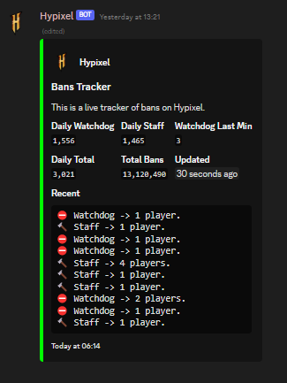

# 🏰 HypixelBanChecker 🛡️

Welcome to the HypixelBanChecker, a discord bot that actively monitors and reports bans on the Hypixel Minecraft server. The bot is intended to assist administrators and players by providing real-time ban data fetched directly from the Hypixel API. It's designed to work seamlessly with your existing discord channels.

## 📸 Preview


## 📖 About

HypixelBanChecker tracks watchdog (automatic) and staff (manual) bans on the Hypixel Minecraft server. The bot is easy to set up and use, and it offers real-time updates on the ban status of players on the Hypixel server.

## 🚀 Features

1. **Real-time Updates** - The bot checks the ban status every 30 seconds.
2. **Easy to Use Commands** - Subscribing or unsubscribing a channel from the ban updates is as simple as running a command.
3. **Embeds for Better Visualization** - The bot uses Discord Embeds for a better visual presentation of ban data.

## 🛠️ Setup

1. Clone the repository & install the requirements.
2. Update the `config.yaml` file with the needed info.
3. Run the bot with the following command:
```bash
python main.py
```
4. Use the commands to subscribe channels and send the embed on the next bans loop iteration.

## 🖐️ Commands

- `/ping` - Tests the bot.
- `/log_channel` - Sets the channel where the bot will send logs.
- `/broadcast` - Subscribes the channel to the Ban Tracker.
- `.sync` - Syncs the bot commands with the server. (You can provide a Guild ID to sync a specific server only)

## ⚠️ Disclaimer

This is a Proof of Concept (PoC) project. It is not officially affiliated with, maintained, sponsored or endorsed by Hypixel or Mojang/Microsoft. Use this tool responsibly and respect the Hypixel server rules and terms.
